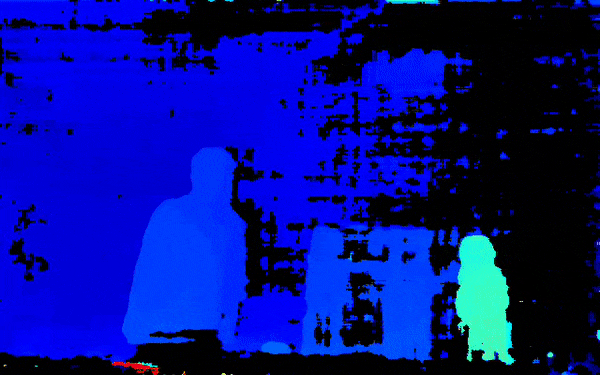
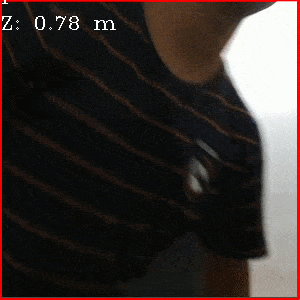

# OAK-D_Experiments
This repository contains examples of using depthai API with OAK-D.

* [Link to the depthai website](https://luxonis.com/depthai)
* [Link to the depthai documentation](https://docs.luxonis.com/)

Depthai is a great boon for the real time SpatialAI community.

This is how my OAK-D looks

## Basic

#### [1. Object detection](exp/code1.py)

This code shows how to :
1. Initialise the device.
2. Get the data packets from the device. (The bounding box and the rgb frame)
3. Draw the bounding box using the extracted bounding box information on the extracted image from the stream.
4. Display the output

#### [2. Access right and left frames of the stereo camera setup](exp/code2.py)

This code shows how to :
1. Initialise the device.
2. Read and display left and right images captured from the stereo camera setup.
This code can be helpful to get started with experiments involving stereo camera images.

#### [3. Display the disparity map in colored format](exp/code3.py)

This code shows how to :
1. Initialise the device.
2. Read and display the disparity map from the device in color format.

This code can be helpful to get started with experiments involving depth information.
The beauty of OAK-D is that it makes the process of generating the disparity map information super easy.

#### [4. Display object detection results with distance](exp/code6.py)

A small modification to the first object detection code - also reading and displaying the distance of the detected obects.

This code shows how to :
1. Initialise the device.
2. Get the data packets from the device. (The bounding box and the rgb frame)
3. Draw the bounding box using the extracted bounding box information on the extracted image from the stream.
4. Read the distance information and print it along with the bounding box.
5. Display the output.

